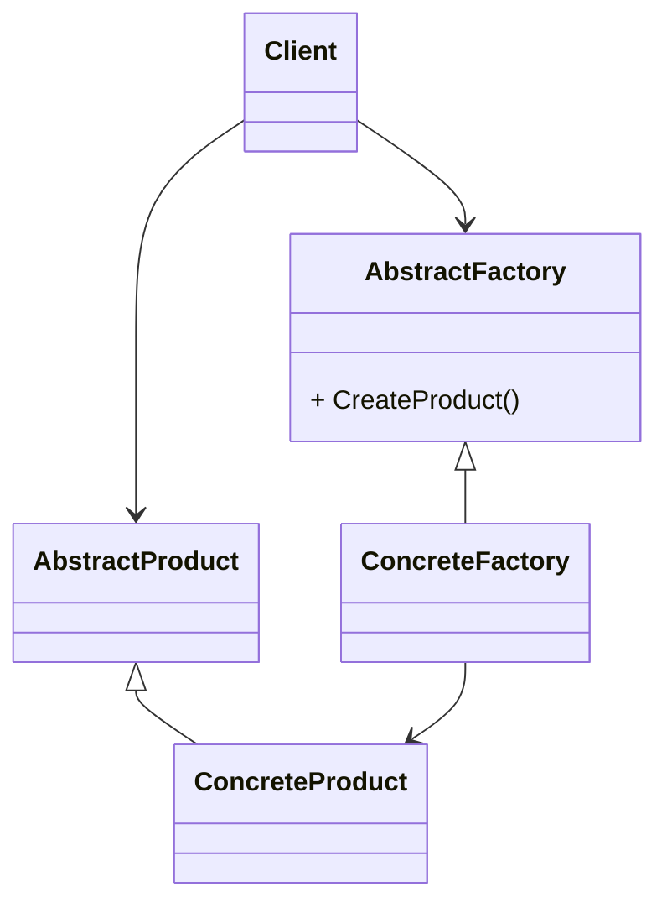

# 抽象工厂模式（Abstract Factory Pattern）

> Provide an interface for creating families of related or dependent objects without specifying their concrete classes.

> 为创建一组相关或相互依赖的对象提供一个接口，而且无需指定它们的具体类。

## 抽象工厂模式的优点

* 封装性。每个产品的实现类不是高层模块要关心的，它要关心的是接口，是抽象，它不关心对象是如何创建出来。它只需要关心工厂，只要知道工厂是谁，就能创建出一个需要的对象。
* 产品族内的约束为非公开状态。

## 抽象工厂模式的缺点

抽象工厂模式的最大缺点就是产品族扩展非常困难。增加一个产品A，抽象类`AbstractCreator`要增加一个方法`createProductA()`，然后两个实现类都要修改，这严重违反了开闭原则。

## 抽象工厂模式的使用场景

抽象工厂模式的使用场景定义非常简单：一个对象族（或是一组没有任何关系的对象）都有相同的约束，则可以使用抽象工厂模式。

## 抽象工厂模式的注意事项

在抽象工厂模式的缺点中，我们提到抽象工厂模式的产品族扩展比较困难，但是一定要清楚，是产品族扩展困难，而不是产品等级。
在该模式下，产品等级是非常容易扩展的，增加一个产品等级，只要增加一个工厂类负责新增加出来的产品生产任务即可。
也即是说，横向扩展容易，纵向扩展困难。