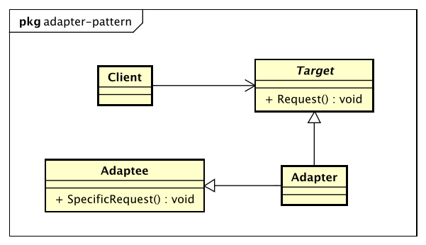

# 适配器模式

> Convert the interface of a class into another interface clients expect.
> Adapter lets classes work together that couldn't otherwise because of incompatible interfaces.

> 将一个类的接口变换成客户端所期待的另一种接口，从而使原本因接口不匹配而无法一起工作的两个类能够在一起工作。

* Target目标角色

    该角色定义把其他类转换为何种接口，也就是我们的期望接口。

* Adaptee源角色

    你想把谁转换成目标角色，这个「谁」就是源角色，它是已经存在的、运行良好的类或对象，经过适配器角色的包装，它会成为一个崭新、靓丽的角色。

* Adapter适配器角色

    适配器模式的核心角色，其他两个角色都是已经存在的角色，而适配器角色是需要新建立的，它的职责非常简单：把源角色转换为目标角色，怎么转换？通过继承或是类关联的方式。

## 适配器模式的优点

* 适配器模式可以让两个没有任何关系的类一起运行
* 增加了类的透明性
* 提高了类的复用性
* 灵活性非常好

## 适配器模式的使用场景

你有动机修改一个已经投产的接口时，适配器模式可能是最适合的模式。

## 适配器模式的注意事项

适配器模式最好在详细设计阶段不要考虑它，它不是为了解决还处在开发阶段的问题，而是解决正在服役的项目的问题，没有一个系统分析师会在做详细设计的时候考虑使用适配器模式，这个模式使用的主要场景是扩展应用。
