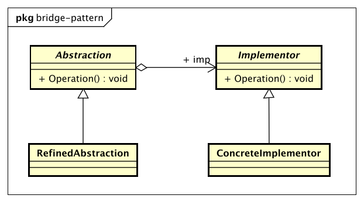

# 桥梁模式（Bridge Pattern）

桥梁模式也叫做桥接模式。

> Decouple an abstraction from its implementation so that the two can vary independently.

> 将抽象和实现解耦，使得两者可以独立地变化。

* Abstraction抽象化角色

    它的主要职责是定义出该角色的行为，同时保存一个对实现化角色的引用，该角色一般是抽象类。

* Implementor实现化角色

    它是接口或者抽象类，定义角色必须的行为和属性。

* RefinedAbstraction修正抽象化角色

    它引用实现化角色对抽象化角色进行修正。

* ConcreteImplementor具体实现化角色

    它实现接口或抽象类定义的方法和属性。

## 桥梁模式的优点

* 抽象和实现分离

* 优秀的扩充能力

* 实现细节对客户透明

## 桥梁模式的使用场景

* 不希望或不适用使用继承的场景

* 接口或抽象类不稳定的场景

* 重用性要求较高的场景
