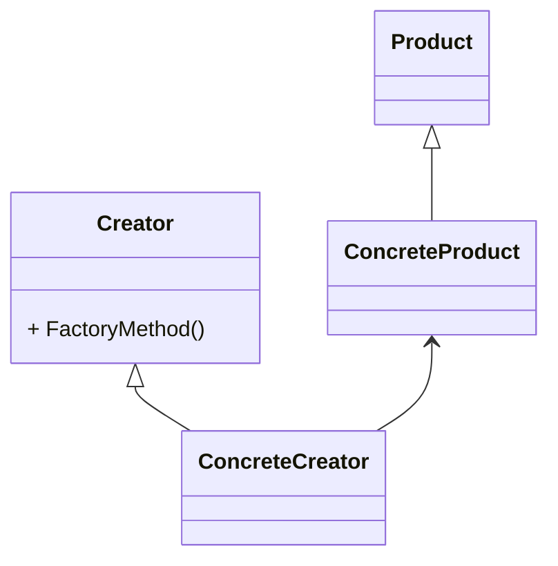

# 工厂方法模式（Factory Method Pattern）

> Define an interface for creating an object, but let subclasses decide which class to instantiate.
> Factory Method lets a class defer instantiation to subclasses.

> 顶一个用于创建对象的接口，让子类决定实例化哪一个类。工厂方法使一个类的实例化延迟到其子类。



## 工厂方法模式的优点

* 良好的封装性，代码结构清晰。一个对象创建是有条件约束的，如一个调用者需要一个具体的产品对象，只要知道这个产品的类名（或约束字符串）就可以了，不用知道创建对象的艰辛过程，降低模块间的耦合。
* 工厂方法模式的扩展性非常优秀。在增加产品类的情况下，只要适当地修改具体的工厂类或扩展一个工厂类，就可以完成『拥抱变化』。
* 屏蔽产品类。这一特点非常有用，产品类的实现如何变化，调用者都不需要关心，它只需要关心产品的接口，只要接口保持不变，系统中的上层模块就需要发生变化。
* 工厂方法模式是典型的解耦框架。高层模块只需要知道产品的抽象类，其他的实现类都不用关心。

## 工厂方法模式的扩展

* 缩小为简单工厂模式（Simple Factory Pattern）

    简单工厂模式也叫做静态工厂模式。在实际项目中，采用该方法的案例还是比较多的，
    其缺点是工厂类的扩展比较困难，不符合开闭原则，但它仍然是一个非常实用的设计模式。

* 升级为多个工厂类

    每一个产品类都对应了一个创建类，好处就是创建类的职责清晰，而且结构简单，但是给可扩展性和可维护性带来了一定的影响。
    由于要扩展一个产品类，就需要建立一个相应的工厂类，这样就增加了扩展的难度。
    因为工厂类和产品类的数量相同，维护时需要考虑两个对象之间的关系。

* 替代单例模式

* 延迟初始化

    延迟初始化（Lazy initialization）：一个对象被消费完毕后，并不立刻释放，工厂类保持其初始状态，等待再次被使用。
    延迟初始化是工厂模式的一个扩展应用，其通用类图如下：

    ```mermaid
    classDiagram
        ProductFactory o--> Product
        Product <|-- ConcreteProduct
        ProductFactory : + static final Map prMap
        ProductFactory : + static synchronized Product createProduct()
        Product : + void doSomething()
    ```
