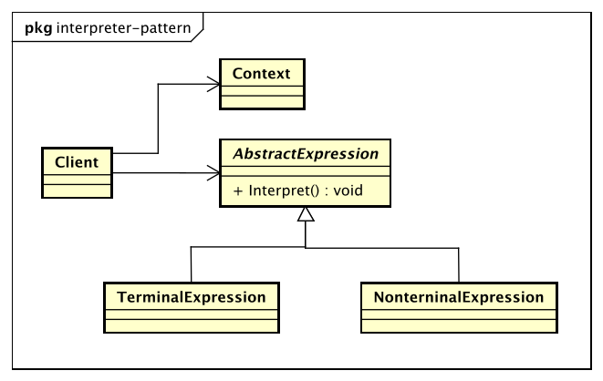

# 解释器模式（Interpreter Pattern）

> Given a language, define a representation for its grammar along with an interpreter that uses the representation to interpret sentences int the language.

> 给定一门语言，定义它的文法的一种表示，并定义一个解释器，该解释器使用该表示来解释语言中的句子。

* AbstractExpression抽象解释器

* TerminalExpression终结符表达式

    实现与文法中元素相关联的解释操作，通常一个解释器模式中只有一个终结符表达式，但有多个实例，对应不同的终结符。

* NonterminalExpression非终结符表达式

    文法中的每条规则对应于一个非终结符表达式。

* Context环境角色

## 解释器模式的优点

解释器是一个简单语法分析工具，它最显著的优点就是扩展性，修改语法规则只需要修改相应非终结符表达式就可以了，若扩展语法，则只要增加非终结符类就可以了。

## 解释器模式的缺点

* 解释器模式会引起类膨胀

* 解释器模式采用递归调用方法

* 效率问题

## 解释器模式的使用场景

* 重复发生的问题可以使用解释器模式

* 一个简单语法需要解释的场景
