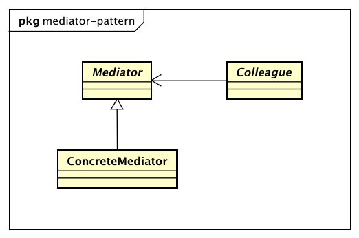

# 中介者模式（Mediator Pattern）

> Define an object that encapsulates how a set of objects interact.
> Mediator promotes loose coupling by keeping objects from referring to each explicitly,
> and it lets you vary their interaction independently.

> 用一个中介对象封装一系列的对象交互，中介者使各对象不需要显示地相互作用，从而使其耦合松散，而且可以独立地改变它们之间的交互。

## 中介者模式的优点

中介者模式的优点就是减少类间的依赖，把原有的一对多的依赖变成了一对一的依赖，同时降低了类间的耦合。

## 中介者模式的缺点

中介者模式的缺点就是中介者会膨胀得很大，而且逻辑复杂，原本N个对象直接的相互依赖转换为中介者和同事类的依赖关系，同事类越多，中介者的逻辑就越复杂。

## 中介者模式使用场景

* N个对象之间产生了相互的依赖关系（N>2）。
* 对个对象有依赖关系，但是依赖的行为尚不确定或者有发生改变的可能，在这种情况下建议采用中介者模式，降低变更引起的风险扩散。
* 产品开发。把中介者模式应用到产品中，可以提升产品的性能和扩展性，但是对于项目开发就未必，因为项目是以交互投产为目标，而产品则是以稳定、高效、扩展为宗旨。
