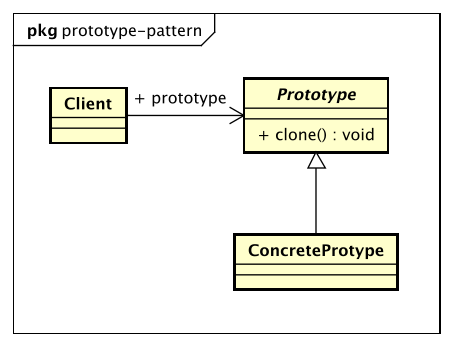

# 原型模式（Prototype Pattern）

> Specify the kinds of objects to create using a prototypical instance,
> and create new objects by copying this prototype.

> 用原型实例指定创建对象的种类，并且通过拷贝这些原型创建新的对象。

## 原型模式的优点

* 性能优良

    原型模式是在内存二进制流的拷贝，要比直接new一个对象性能好很多，特别是要在一个循环体内产生大量的对象时，原型模式可以更好地体现其优点。

* 逃避构造函数的约束

    这即是优点也是缺点，直接在内存中拷贝，构造函数是不会执行的。优点是减少了约束，缺点也是减少了约束。

## 原型模式的使用场景

* 资源优化场景

    类初始化需要消化非常多的资源，这个资源包括数据、硬件资源的。

* 性能和安全要求的场景

    通过new产生一个对象需要非常繁琐的数据准备或访问权限，则可以使用原型模式。

* 一个对象多个修改者的场景

    一个对象需要提供给其他对象访问，而且每个调用者可能都需要修改其值时，可以考虑使用原型模式拷贝多个对象供调用者使用。

## 原型模式的注意事项

* 构造函数不会被执行

* 浅拷贝和深拷贝

* clone和final
