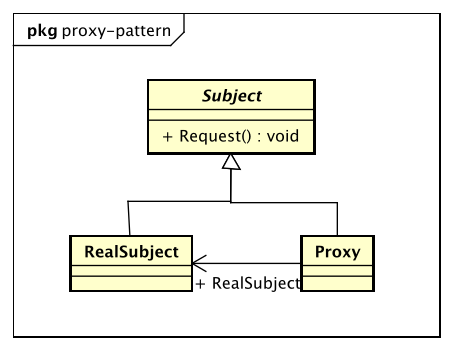

# 代理模式（Proxy Pattern）

> Provide a surrogate or placeholder for another object to control access to it.

> 为其他对象提供一种代理以控制对这个对象的访问。

## 代理模式的优点

* 职责清晰
* 高扩展性
* 智能化

## 代理模式的扩展

* 普通代理

    普通代理，它的要求就是客户端只能访问代理角色，而不能访问真实角色。

* 强制代理

    必须通过真实角色查到代理角色，否则你不能访问。

* 代理是有个性的

    一个类可以实现多个接口，完成不同任务的整合。

* 虚拟代理

    在需要的时候才初始化主体对象，可以避免被代理对象较多引起的初始化缓慢的问题。其缺点是需要在每个方法中判断主体对象是否被创建。

* 动态代理
