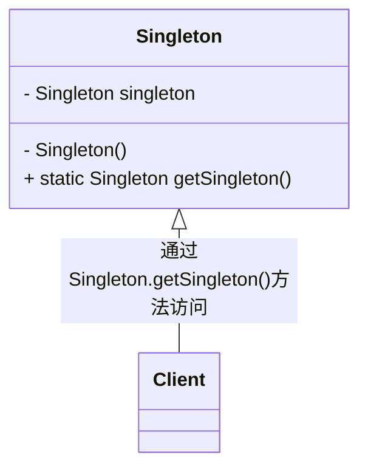

# 单例模式（Singleton Pattern）

> Ensure a class has only one instance, and provide a global point of access to it.

> 确保某一个类只有一个实例，而且自行实例化并向整个系统提供这个实例。

## 单例模式的优点

* 由于单例模式在内存中只有一个实例，减少了内存开支。
* 由于单例模式只生成一个实例，所以减少了系统的性能开销。
* 单例模式可以避免对资源的多重占用。
* 单例模式可以在系统设置全局的访问点，优化和共享资源访问。

## 单例模式的缺点

* 单例模式一般没有接口，扩展很困难。
* 单例模式对测试是不利的。在并行开发环境中，如果单例模式没有完成，是不能进行测试的，没有接口也不能使用mock的方式虚拟一个对象。
* 单例模式与[单一职责原则][srp]有冲突。一个类应该只实现一个逻辑，而不关心它是否是单例的，是不是要单例取决于环境。

## 单例模式注意事项

* 在高并发情况下，注意单例模式的线程同步问题。
* 考虑对象的复制情况。

## 单例模式的扩展

如果一个类可以产生多个对象，对象的数量不受限制，直接使用new关键字就可以了，如果只要有一个对象，使用单例模式就可以了，但是如果要求一个类只能产生两三个对象，这时候可以使用多例模式。

需要产生固定数量对象的模式叫做有上限的多例模式，它是单例模式的一种扩展，采用有上限的多例模式，我们可以在设计时决定在内存中有多少个实例，方便系统进行扩展，修正单例可能存在的性能问题，提供系统的响应速度。

[srp]: ../principles/srp.md
