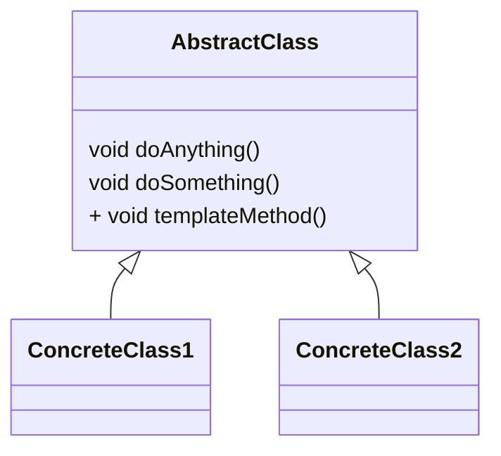

# 模板方法模式（Template Method Pattern）

> Define the skeleton of an algorithm in an operation, deferring some steps to subclasses.
> Template Method lets subclasses redefine certain steps of an algorithm without changing the algorithm's structure.

> 定义一个操作中的算法的框架，而将一些步骤延迟到子类中。使得子类可以不改变一个算法的结构即可重定义该算法的某些特定步骤。

* 基本方法

    基本方法也叫做基本操作，是由子类实现的方法，并且在模板方法被调用。

* 模板方法

    可以有一个或几个，一般是一个具体方法，也叫做一个框架，实现对基本方法的调度，完成固定的逻辑。

    为了防止恶意操作，一般模板方法都加上`final`关键字，不允许被覆写。

## 模板方法模式的优点

* 封装不变部分，扩展可变部分
* 提取公共部分代码，便于维护
* 行为由父类控制，子类实现

## 模板方法模式的缺点

按照一般设计习惯，抽象类负责声明最抽象、最一般的事物属性和方法，实现类完成具体的事物属性和方法。但是模板方法模式却颠倒了，抽象类定义了部分抽象方法，由子类实现，子类执行的结果影响了父类的结果，也就是子类对父类产生了影响，这在复杂的项目中，会带来代码阅读的难度。

## 模板方法模式的使用场景

* 多个子类有公有的方法，并且逻辑基本相同。
* 重要、复杂的算法，可以把核心算法设计为模板方法，周边的相关细节功能则由各个子类实现。
* 重构时，模板方法模式是一个经常使用的模式，把相同的代码抽取到父类中，然后通过钩子函数约束其行为。
