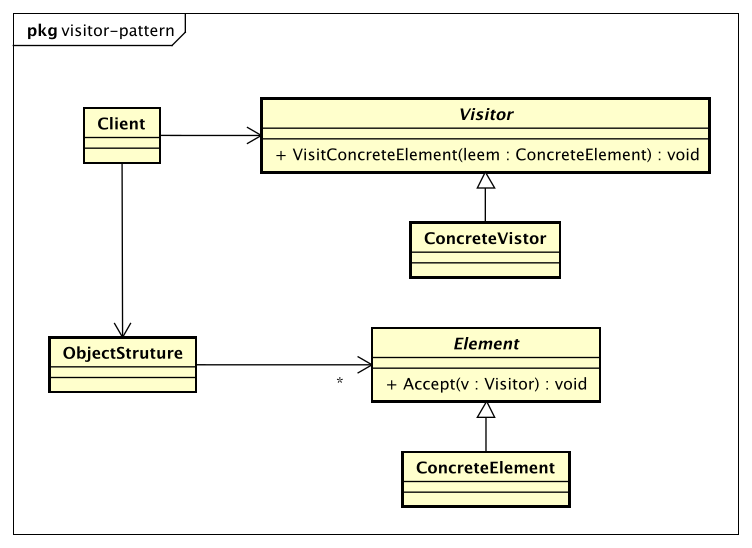

# 访问者模式（Visitor Pattern）

> Represent an operation to be performed on the elements of an object structure.
> Visitor lets you define a new operation without changing the classes of the elements on which it operates.

> 封装一些作用于某些数据结构中各元素的操作，它可以在不修改数据结构的前提下定义作用于这些元素的新的操作。

* Visitor抽象访问者

    抽象类或接口，声明访问者可以访问哪些元素，具体到程序中就是visit方法的参数定义哪些对象是可以被访问的。

* ConcreteVistor具体访问者

    它影响访问者访问到一个类后该怎么干，要做什么事情。

* Element抽象元素

    接口或者抽象类，声明接受哪一类访问者访问，程序上是通过accept方法中的参数来定义的。

* ConcreteElement具体元素

    实现accept方法，通常`visitor.visit(this)`，基本上都形成了一种模式了。

* ObjectStruture结构对象

    元素产生者，一般容纳在多个不同类、不同接口的容器，如List、Set、Map等。

## 访问者模式的优点

* 符合单一职责原则
* 优秀的扩展性
* 灵活性非常高

## 访问者模式的缺点

* 具体元素对访问者公布细节
* 具体元素变更比较困难
* 违背了依赖倒置原则

## 访问者模式的使用场景

* 一个对象结构包含很多对象，它们有不同的接口，而你想对这些对象实施一些依赖于具体类的操作。
* 需要对一个对象结构中的对象进行很多不同并且不相关的操作。
